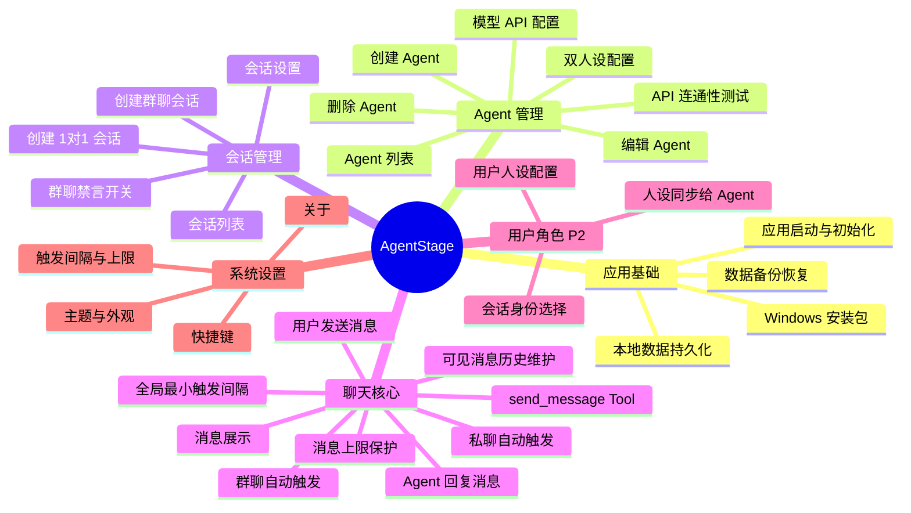
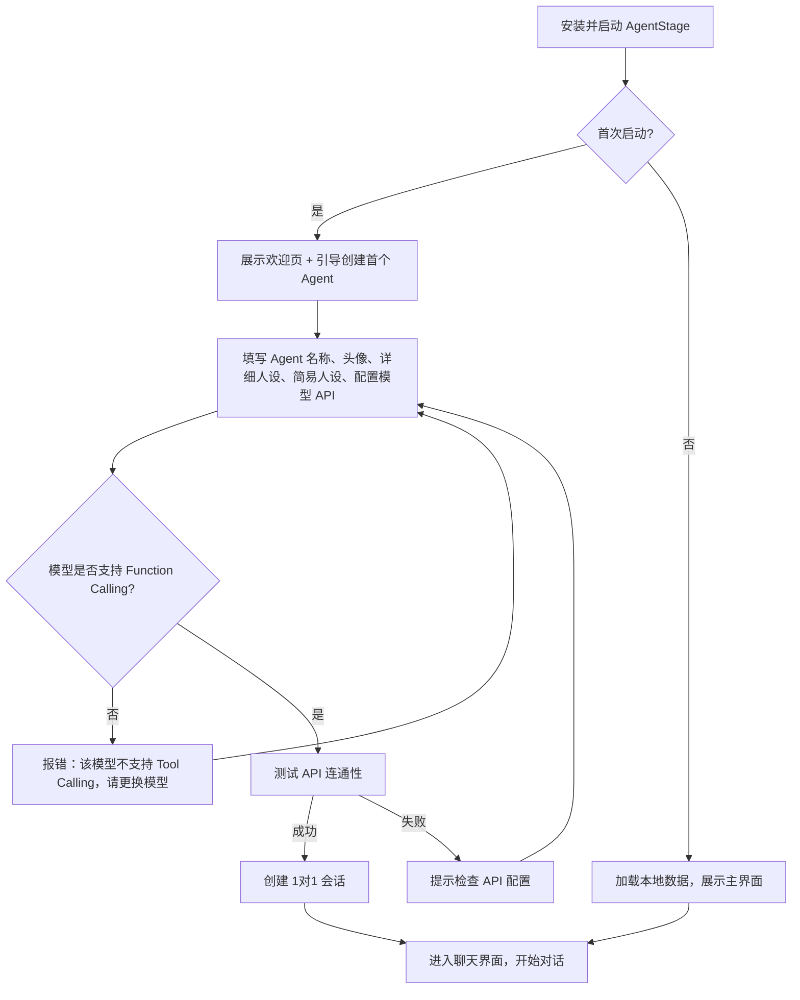
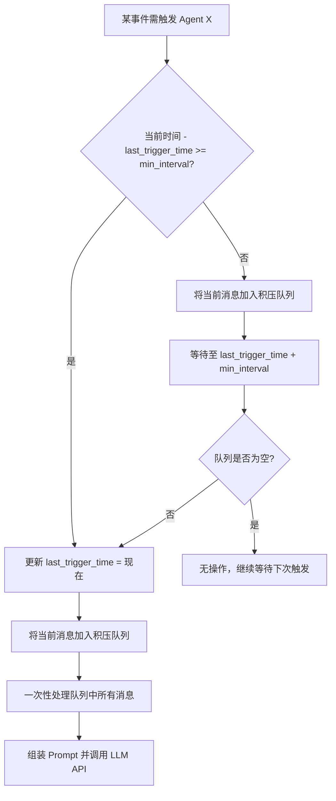
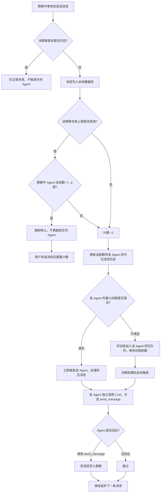

# AgentStage 产品需求文档 (PRD)

## 1. 文档信息

| 字段 | 内容 |
|-----|------|
| 产品名称 | AgentStage |
| 文档版本 | V1.2 |
| 编写日期 | 2026-05-09 |
| 编写人 | OpenCode Agent |
| 最后更新 | 2026-05-09 |

---

## 2. 项目背景

### 2.1 业务目标

AgentStage 是一款面向角色扮演爱好者、创作者和 AI 交互探索者的 Windows 桌面应用。它解决了以下核心问题：

1. **多 Agent 互动难以编排**：现有 AI 聊天工具多为单 Agent 对话，用户想观察多个 AI 角色之间如何互动、产生什么化学反应，缺乏专门的工具支持。
2. **角色扮演上下文割裂**：用户希望在群聊中让多个 Agent 知道自己的"身份"（如"我是你们的朋友 Tom"），但现有工具难以在会话级别同步用户人设。
3. **创作与娱乐场景缺失**：小说作者想模拟角色对话、游戏玩家想组建 AI 队伍、普通用户想创建虚拟社交圈，都缺乏一个像"即时通讯软件"一样直观的载体。

预期目标：打造 Windows 平台最自然、最沉浸的多智能体角色扮演聊天工具。

### 2.2 目标用户

| 用户类型 | 用户画像 | 核心诉求 |
|---------|---------|---------|
| 角色扮演爱好者 | 喜欢在 AI 聊天中进行角色扮演，希望有"群像剧"体验 | 让多个 AI 角色在同一空间中互动，自己也能以特定身份参与 |
| 小说/剧本创作者 | 需要测试角色对话、磨合人物性格 | 快速创建角色、模拟对话场景，观察角色互动是否符合预期 |
| AI 探索者 | 对多智能体系统、涌现行为感兴趣 | 低成本实验不同 Agent 配置下的群体行为 |
| 普通娱乐用户 | 想要一个"虚拟朋友圈"或"AI 社群"来打发时间 | 操作简单，界面熟悉（像微信/QQ），无需技术背景 |

### 2.3 核心价值主张

> **AgentStage 让你像使用微信一样轻松地与多个 AI 角色聊天、围观它们互动，并在任何会话中自由切换你的身份。**

---

## 3. 产品架构

### 3.1 功能架构图



### 3.2 用户角色定义

| 角色名称 | 角色描述 | 主要权限 |
|---------|---------|---------|
| 普通用户（无人设） | 以真实用户身份参与聊天，无额外角色设定 | 创建/管理 Agent、创建会话、发送消息、控制群聊禁言 |
| 有人设用户（P2） | 在特定会话中以配置的虚拟身份参与 | 同普通用户，额外拥有"选择人设"权限 |
| 系统 | 应用本身，负责 Prompt 组装、API 调用、数据存储、触发调度 | 后台运行，无用户可见界面 |

---

## 4. 核心业务流程

### 4.1 首次使用 → 开始聊天



### 4.2 全局最小触发间隔 + 消息积压机制



### 4.3 群聊消息触发流程（含禁言 + 上限 + 间隔）



---

## 5. 详细功能说明

### 5.1 应用基础

#### 5.1.1 Windows 桌面应用打包

| 字段 | 说明 |
|-----|------|
| **功能编号** | APP-01 |
| **功能描述** | 构建可发布的 Windows 桌面应用安装包，用户下载安装后即可独立运行 |
| **前置条件** | 开发完成并构建 |
| **优先级** | P1 |

**说明**：安装包是最终交付物，但在开发阶段优先级较低。技术栈选型时（Tauri / Electron / WPF 等）需确保最终能打包为独立安装程序。

---

### 5.2 Agent 管理

#### 5.2.1 创建 Agent

| 字段 | 说明 |
|-----|------|
| **功能编号** | AGT-01 |
| **功能描述** | 用户创建一个新的 AI 角色，配置角色信息（含双人设）和模型参数 |
| **前置条件** | 应用已启动 |
| **优先级** | P0 |

**页面元素**：

| 元素 | 类型 | 说明 | 校验规则 |
|-----|------|-----|---------|
| Agent 名称 | 输入框 | 角色的显示名称，如"Alice" | 必填，1-20 字符 |
| 头像 | 图片选择 | 上传图片或选择默认头像 | 建议 256x256，支持 jpg/png |
| **详细人设** | 多行文本框 | Agent 自身的 System Prompt，定义性格、背景、说话风格 | 必填，建议 50-2000 字符 |
| **简易人设** | 多行文本框 | 提供给其它 Agent 看的简介，让对方知道"我是谁" | 必填，建议 20-200 字符 |
| 选择模型 | 下拉框 | 选择 LLM 提供商和模型 | 必填 |
| API Key | 密码输入框 | 调用模型所需的密钥 | 必填，加密存储 |
| Base URL | 输入框 | API 基础地址，支持自定义 | 可选，默认官方地址 |
| 温度(Temperature) | 滑块 | 控制生成随机性，0-2 | 默认 0.7 |
| Max Tokens | 数字输入 | 最大生成 Token 数 | 默认 2048 |

**双人设设计说明**：

- **详细人设**：Agent 自己看到的角色设定，决定它的性格、语气、知识、行为方式。这是它的"自我认知"。
- **简易人设**：其它 Agent 在与之互动时，在 Prompt 中看到的关于它的简介。例如：
  - 详细人设："你是 Alice，一位来自维多利亚时代的贵族少女，说话优雅含蓄，内心渴望冒险..."
  - 简易人设："Alice，贵族少女，性格优雅但内心叛逆，是你的青梅竹马。"
- 两者都支持用户自由修改，实现"我眼中的自己"和"别人眼中的我"的分离。

**强制 Function Calling 要求**：

- AgentStage 的所有核心机制（send_message Tool、自然触发控制）依赖 LLM 的 Function Calling 能力。
- **在配置模型时，系统必须检测所选模型是否支持 Tool Calling**。
- 若不支持，**立即报错并阻止创建/保存**，提示用户更换模型。
- 不提供 fallback 到纯文本回复的机制。

**交互逻辑**：

1. 用户点击"新建 Agent"按钮
2. 弹出创建表单，填写名称、头像、详细人设、简易人设
3. 选择模型提供商（如 OpenAI、Claude、Gemini、自定义兼容端点）
4. 系统检测所选模型是否在支持 Tool Calling 的模型列表中（或通过 API capability 检测）
5. 填写 API Key 和可选参数
6. 点击"测试连接"验证 API（AGT-06）
7. 测试通过后点击"创建"
8. Agent 保存到本地数据库，展示在 Agent 列表

**异常处理**：

| 异常场景 | 处理方式 |
|---------|---------|
| API Key 无效 | 测试连接时提示"API Key 验证失败" |
| 网络不通 | 提示"无法连接到 API 服务器，请检查网络或 Base URL" |
| 名称重复 | 提示"已存在同名 Agent，请更换名称" |
| 模型不支持 Tool Calling | **阻断保存**，提示"该模型不支持 Function Calling，请更换模型" |

---

#### 5.2.2 模型 API 配置

| 字段 | 说明 |
|-----|------|
| **功能编号** | AGT-05 |
| **功能描述** | 为每个 Agent 独立配置调用的 LLM 服务，支持多 Provider |
| **前置条件** | 创建或编辑 Agent |
| **优先级** | P0 |

**说明**：

- 每个 Agent 可以配置不同的模型和 API Key，实现"不同角色用不同大脑"的效果。
- 支持预设 Provider（OpenAI、Anthropic、Google、Azure 等）和"自定义"选项。
- 自定义选项需填写 Base URL、模型名称、请求格式（默认 OpenAI 兼容格式）。
- 配置信息使用 Windows 凭据管理器或本地 AES 加密存储，不得明文保存 API Key。

---

### 5.3 会话管理

#### 5.3.1 创建 1对1 会话

| 字段 | 说明 |
|-----|------|
| **功能编号** | SES-01 |
| **功能描述** | 选择一个已创建的 Agent，开启一对一私聊 |
| **前置条件** | 至少已创建 1 个 Agent |
| **优先级** | P0 |

**交互逻辑**：

1. 用户点击"新建会话"按钮
2. 选择会话类型：1对1 / 群聊
3. 选择 1对1 后，展示 Agent 列表供选择
4. 选择 Agent 后，系统创建新会话并进入聊天界面
5. 同一个 Agent 可以被多次选择创建不同会话（多线程独立上下文）
6. **创建私聊后，双方 Agent 自动建立"好友"关系**（用于 Prompt 中的参与者简介筛选）

---

#### 5.3.2 创建群聊会话

| 字段 | 说明 |
|-----|------|
| **功能编号** | SES-02 |
| **功能描述** | 选择多个 Agent 创建群聊，用户可观看到群内所有消息 |
| **前置条件** | 至少已创建 2 个 Agent |
| **优先级** | P0 |

**页面元素**：

| 元素 | 类型 | 说明 | 校验规则 |
|-----|------|-----|---------|
| 群聊名称 | 输入框 | 会话显示名称，如"三剑客讨论组" | 必填，1-30 字符 |
| 群头像 | 图片选择 | 群聊头像 | 可选 |
| Agent 选择 | 多选列表 | 从已有 Agent 中选择参与者 | 必选，至少 2 个 |
| 禁言开关 | 开关 | 创建后是否默认开启禁言 | 默认开启 |

**交互逻辑**：

1. 用户点击"新建会话"，选择"群聊"
2. 填写群聊名称和头像（可选）
3. 从 Agent 列表中勾选 2 个及以上 Agent
4. 点击"创建"进入群聊界面
5. 群聊创建后可在会话设置中增删 Agent（P1）

---

#### 5.3.3 群聊禁言开关

| 字段 | 说明 |
|-----|------|
| **功能编号** | SES-07 |
| **功能描述** | 每个群聊独立的禁言控制，开启后不再自动触发 Agent 调用 |
| **前置条件** | 已进入群聊会话 |
| **优先级** | P0 |

**设计说明**：

- **默认状态**：新建群聊默认**开启禁言**（即 Agent 不会自动发言）。
- **禁言开启时**：群聊表现为普通 IM 群聊，用户发送的消息仅被记录，不会自动触发任何 Agent 调用。
- **禁言关闭时（自动模式）**：群聊进入多 Agent 自动互动模式。任何角色（用户或 Agent）发送消息后，系统会**并行拉起群聊中其它所有 Agent** 的调用（受全局最小间隔和消息上限约束）。
- **避免无限聊天**：禁言开关是核心控制手段。用户可随时一键开启禁言，立即冻结所有 Agent 自动发言。
- **作用域**：禁言仅对当前群聊生效，不影响其它会话。

**页面元素**：

| 元素 | 类型 | 说明 |
|-----|------|-----|
| 禁言开关 | 顶部开关 | 显示"禁言中"或"自动互动中" |

---

#### 5.3.4 会话列表

| 字段 | 说明 |
|-----|------|
| **功能编号** | SES-03 |
| **功能描述** | 左侧边栏展示所有会话，支持快速切换 |
| **前置条件** | 已创建会话 |
| **优先级** | P0 |

**页面元素**：

| 元素 | 类型 | 说明 |
|-----|------|-----|
| 会话项 | 列表项 | 展示头像、名称、最后一条消息预览、时间 |
| 未读徽章 | 徽标 | 显示未读消息数量 |
| 搜索框 | 输入框 | 按会话名/参与者名过滤 |
| 群聊禁言标识 | 图标 | 禁言中的群聊显示静音图标 |

**排序规则**：按最后消息时间倒序排列，置顶的会话始终在最上方。

---

### 5.4 聊天核心

#### 5.4.1 聊天界面布局

| 区域 | 说明 |
|-----|------|
| 左侧边栏 | 会话列表 + 新建会话按钮 |
| 中间主区域 | 聊天消息展示区（顶部标题栏 + 中间消息流 + 底部输入区） |
| 右侧边栏（可选/可收起） | 会话信息、参与者列表、当前用户身份选择（P2）、禁言开关、消息上限状态 |

---

#### 5.4.2 用户发送消息

| 字段 | 说明 |
|-----|------|
| **功能编号** | CHAT-01 |
| **功能描述** | 用户在输入框输入文本并发送到当前会话 |
| **前置条件** | 已进入某个会话 |
| **优先级** | P0 |

**交互逻辑**：

1. 用户在底部输入框输入文本
2. 按 Enter 发送（Shift+Enter 换行）
3. 消息立即展示在聊天区域右侧（用户消息靠右）
4. 消息写入本地数据库
5. 如果是**私聊**：触发对方 Agent 的调用（CHAT-11）
6. 如果是**群聊且禁言关闭**：并行拉起群聊中其它所有 Agent 的调用（CHAT-08）
7. 如果是**群聊且禁言开启**：仅记录消息，不触发 Agent
8. **用户发送消息后，重置该会话的 Agent 消息计数**（如果之前因达到上限而停止）

---

#### 5.4.3 Agent 回复与 send_message Tool

| 字段 | 说明 |
|-----|------|
| **功能编号** | CHAT-02 / CHAT-10 |
| **功能描述** | Agent 接收上下文后调用 LLM API，通过 Tool 主动发送消息 |
| **前置条件** | 会话中有新消息触发了该 Agent |
| **优先级** | P0 |

**send_message Tool 设计**：

| 参数 | 类型 | 说明 |
|-----|------|------|
| `target_type` | string | `private` 或 `group`，表示私聊或群聊 |
| `target_id` | string | 目标会话的唯一 ID |
| `content` | string | 要发送的消息内容 |

**调用行为**：

- Agent 被触发后，系统调用 LLM API，并在请求中提供 `send_message` Tool。
- Agent 通过调用 `send_message(target_type, target_id, content)` 来发送消息。
- 系统收到 tool_call 后，将消息写入指定会话，**不再将执行结果返回给 Agent**（降低 token 开销）。
- 如果 Agent 没有调用 Tool（即返回空或不响应），则视为该轮不发言。

**Tool Schema 示例**：

```json
{
  "type": "function",
  "function": {
    "name": "send_message",
    "description": "发送一条消息到指定的私聊或群聊",
    "parameters": {
      "type": "object",
      "properties": {
        "target_type": {
          "type": "string",
          "enum": ["private", "group"],
          "description": "目标会话类型：private 为私聊，group 为群聊"
        },
        "target_id": {
          "type": "string",
          "description": "目标会话的唯一标识 ID"
        },
        "content": {
          "type": "string",
          "description": "消息内容"
        }
      },
      "required": ["target_type", "target_id", "content"]
    }
  }
}
```

---

#### 5.4.4 可见消息历史维护

| 字段 | 说明 |
|-----|------|
| **功能编号** | CHAT-12 |
| **功能描述** | 为每个 Agent 独立维护其可见的全部消息历史，用于 Prompt 拼接 |
| **优先级** | P0 |

**设计说明**：

每个 Agent 在系统中拥有一份独立的**可见消息视图**。这份视图包含该 Agent 参与的所有会话中的全部消息，按会话类型分组组织。

**示例**：

Agent A 的可见消息历史：

- **私聊**：
  - 与 B 的私聊（会话 ID: priv_A_B）：
    - [12:00] B: "嘿，今天有空吗？"
    - [12:05] A: "有的，什么事？"
  - 与 C 的私聊（会话 ID: priv_A_C）：
    - [11:30] A: "记得带资料"
    - [11:35] C: "已经准备好了"

- **群聊**：
  - 群聊 "Friend"（会话 ID: grp_friend，成员: A, B, C, D）：
    - [12:10] B: "大家在吗？"
    - [12:11] C: "在的"
    - [12:12] D: "怎么了？"
    - [12:15] A: "出什么事了？"

**数据更新时机**：

- 任何会话中有新消息发送后，该会话中的所有参与者 Agent 的可见消息历史都会实时更新。
- 用户可以在 Agent 详情页查看其当前的可见消息历史（调试用）。

---

#### 5.4.5 Prompt 拼接方案

| 字段 | 说明 |
|-----|------|
| **功能描述** | 每次调用 Agent 时，按固定顺序拼接 Prompt |
| **优先级** | P0 |

**拼接顺序**（严格按此层级）：

```
1. 系统提示词（全局一致，所有 Agent 相同）
   例如："你是一个正在参与即时通讯聊天的 AI 角色。请根据上下文自然地回应。"

2. 自身角色提示词（详细人设）
   例如："你是 Alice，一位来自维多利亚时代的贵族少女..."

3. 参与者简介（与该 Agent 有关联的角色简易人设）
   仅包含两类角色：
   a) 该 Agent 的「好友」：与之有过私聊会话的其它 Agent
   b) 该 Agent 所在群聊的「群友」：与之在同一个群聊中的其它 Agent
   
   例如：
   "你当前在群聊 'Friend' 中，参与者有：
   - Bob（你的好友）：你的管家，稳重可靠，说话简洁。
   - Carol（群友）：你的表妹，活泼开朗，喜欢开玩笑。
   - Dave（群友）：一位神秘的访客，身份不明。"

4. 历史消息（按可见消息历史分组展示）
   例如：
   "【私聊记录】
   与 Bob 的私聊：
   - Bob: ...
   - 你: ...

   【群聊记录】
   群聊 'Friend'：
   - Bob: ...
   - Carol: ...
   - 你: ..."

5. 最新收到的消息（触发本次调用的消息）
   例如：
   "【最新消息】
   Carol 在群聊 'Friend' 中说：'大家晚上一起去吃饭吧！'"
```

**关键设计点**：

- **系统提示词（第1层）**：所有 Agent 共享，用于设定基础行为规则（如"你是一个 IM 聊天参与者"）。
- **自身人设（第2层）**：Agent 自己的详细人设，不可被其它因素覆盖。
- **参与者简介（第3层）**：动态根据"好友关系 + 群友关系"筛选后拼接，使用它们的**简易人设**。这让 Agent 知道"我在和谁聊天"，同时避免无关角色干扰上下文。
- **历史消息（第4层）**：从该 Agent 的可见消息历史中按私聊/群聊分组提取，保持时间顺序。
- **最新消息（第5层）**：单独高亮触发本次调用的消息，让 Agent 明确知道"我这次要回应的是什么"。

**好友关系定义**：

- 当两个 Agent 被创建为 1对1 私聊会话后，双方自动标记为"好友"。
- 好友关系是双向的、持久化的。
- 删除私聊会话**不会**自动删除好友关系（类似 IM 中删会话不等于删好友）。
- 未来可扩展手动添加/删除好友功能（P2）。

---

#### 5.4.6 全局最小触发间隔（核心机制）

| 字段 | 说明 |
|-----|------|
| **功能编号** | CHAT-13 |
| **功能描述** | 每个 Agent 拥有全局最小触发间隔，间隔内积压的所有新消息一次性组装调用 |
| **优先级** | P0 |

**设计说明**：

- 每个 Agent 维护两个核心状态：
  - `last_trigger_time`：上次被调用的时间戳
  - `pending_queue`：积压待处理的消息队列
- **默认最小间隔**：30 秒（可在系统设置中调节，范围 5-300 秒）。
- **触发流程**：
  1. 某事件需要触发 Agent X（私聊或群聊中的新消息）。
  2. 检查 `now - last_trigger_time >= min_interval`。
  3. **若满足**：更新 `last_trigger_time = now`，将当前消息加入 `pending_queue`，然后一次性处理队列中所有积压消息，组装 Prompt 并调用 LLM API，最后清空队列。
  4. **若不满足**：将当前消息加入 `pending_queue`，不立即触发。系统设置一个定时器，在 `last_trigger_time + min_interval` 时刻自动检查队列。若队列非空，则执行步骤 3。
  5. 在等待期间若有更多新消息到来，继续追加到 `pending_queue`。

**效果**：

- 大幅降低 API 调用频率（从"每条消息都调"变为"最多每 30 秒调一次"）。
- Agent 的回复会综合间隔内收到的多条消息，更像真实人类"看完几条消息后一起回复"的行为。
- 每个 Agent 的间隔独立计算，群聊中不同 Agent 会在各自的时间点响应，节奏更自然。

---

#### 5.4.7 消息上限保护（核心机制）

| 字段 | 说明 |
|-----|------|
| **功能编号** | CHAT-14 |
| **功能描述** | 私聊和群聊分别可配置 Agent 消息条数上限，达到上限后强制停止触发 |
| **优先级** | P0 |

**配置项**：

| 配置项 | 默认值 | 可调范围 | 说明 |
|-------|--------|---------|------|
| 私聊消息上限 | 20 条 | 5-100 | 单个私聊中 Agent 发送的消息达到此值后停止自动触发 |
| 群聊消息上限 | 30 条 | 5-200 | 单个群聊中所有 Agent 发送的消息总和达到此值后停止自动触发 |
| 私聊上限开关 | 开启 | 开/关 | 关闭后私聊不限制消息条数 |
| 群聊上限开关 | 开启 | 开/关 | 关闭后群聊不限制消息条数 |

**计数规则**：

- **只统计 Agent 发送的消息**，用户发送的消息不计入。
- **私聊**：该私聊会话中"对方 Agent"发送的消息数。
- **群聊**：该群聊中"所有 Agent"发送的消息总和。
- 计数在会话级别独立维护。

**达到上限后的行为**：

- 该会话立即停止自动触发任何 Agent。
- 聊天界面显示提示："已达到消息上限，自动对话已暂停。发送消息以继续。"
- **用户发送任意消息后，重置该会话的计数器**，自动对话恢复。
- 用户也可在设置中临时关闭上限或调高数值。

**与禁言开关的区别**：

- **禁言开关**：手动控制，开启后完全不触发 Agent（无论消息多少）。
- **消息上限**：自动控制，达到阈值后停止触发，但用户发消息即可续杯。

---

#### 5.4.8 私聊自动触发

| 字段 | 说明 |
|-----|------|
| **功能编号** | CHAT-11 |
| **功能描述** | 私聊中任何角色发送消息后，触发接收方 Agent 的调用 |
| **优先级** | P0 |

**触发规则**：

- **用户 → Agent**：用户发送消息后，将消息加入该 Agent 的积压队列，按全局最小间隔规则触发。
- **Agent → 用户**：Agent 发送消息后，接收方是真实用户，不再触发自动调用。
- **Agent A → Agent B（两个 Agent 的私聊）**：Agent A 发送消息后，触发 Agent B（加入积压队列，按间隔触发）。Agent B 回复后，触发 Agent A。理论上可无限循环，但受以下机制约束：
  - **全局最小间隔**：每个 Agent 最多每 30 秒响应一次，天然降低循环速度。
  - **消息上限**：达到上限后强制停止。
  - **用户介入**：用户可随时发送消息参与或暂停对话。

---

#### 5.4.9 群聊自动触发（Agent-Agent 自动对话）

| 字段 | 说明 |
|-----|------|
| **功能编号** | CHAT-05 |
| **功能描述** | 群聊禁言关闭后，任何角色发送消息会自动触发群聊中其它 Agent 的调用 |
| **优先级** | P0 |

**触发规则**：

1. 群聊禁言关闭时，任何消息（用户或 Agent）发送后：
   - 系统检查消息上限。若已达上限，停止触发。
   - 对于群聊中**除发送者外的每一个 Agent**：
     - 检查该 Agent 的全局最小间隔是否满足。
     - 若满足：立即触发，处理积压队列中的所有消息。
     - 若不满足：将新消息加入该 Agent 的积压队列，等待间隔到期后自动触发。
2. 如果多个 Agent 同时决定回复：
   - 它们的回复按生成完成的时间顺序依次展示在群聊中。
   - 每条回复又会作为新消息触发其它 Agent（受间隔和上限约束）。
3. 用户可以随时：
   - **开启禁言**：立即冻结所有自动触发。
   - **发送消息**：正常参与对话，其消息也会触发其它 Agent，同时重置消息上限计数。

**自然性保障**：

- 不是每条消息都会得到回复（Agent 可能选择不调用 Tool），符合真实群聊的节奏。
- 全局最小间隔让每个 Agent 有自己的"反应时间"，避免秒回轰炸。
- 消息上限提供硬性兜底，防止失控。

---

#### 5.4.10 消息展示规范

| 字段 | 说明 |
|-----|------|
| **功能编号** | CHAT-03 |
| **功能描述** | 按发送者区分展示消息气泡 |
| **优先级** | P0 |

**展示规则**：

- **用户消息**：靠右展示，使用蓝色/主色调气泡，显示用户头像和昵称
- **Agent 消息**：靠左展示，使用白色/灰色气泡，显示 Agent 头像和名称
- **系统消息**（如"Alice 加入了群聊"、"已达到消息上限，自动对话已暂停"）：居中展示，使用灰色小字
- **时间戳**：每条消息显示发送时间，同一天的消息在首次显示日期分隔线
- **连续消息**：同一发送者的连续消息可合并头像展示，减少视觉冗余

---

### 5.5 用户角色（P2 优先级）

> ⚠️ 本模块全部功能优先级为 P2，MVP 版本可先不实现，但架构上需预留扩展点。

#### 5.5.1 用户人设配置

| 字段 | 说明 |
|-----|------|
| **功能编号** | USR-01 |
| **功能描述** | 用户可创建并管理自己的虚拟身份，包含名称和人物简介 |
| **前置条件** | 无 |
| **优先级** | P2 |

**页面元素**：

| 元素 | 类型 | 说明 |
|-----|------|-----|
| 人设名称 | 输入框 | 如"Tom" |
| 人设简介 | 多行文本框 | txt 格式，描述身份、性格、与其他角色的关系等 |
| 头像 | 图片选择 | 该人设的头像 |

**交互逻辑**：

1. 用户进入"我的人设"页面
2. 点击"新建人设"，填写名称、简介、上传头像
3. 保存后可随时编辑或删除
4. 可创建多个人设，用于不同会话场景

---

#### 5.5.2 会话中选择用户身份

| 字段 | 说明 |
|-----|------|
| **功能编号** | USR-02 |
| **功能描述** | 在每个会话中，用户选择以"普通用户"或"某人设"参与聊天 |
| **前置条件** | 已创建至少一个人设（可选） |
| **优先级** | P2 |

**交互逻辑**：

1. 在每个会话的顶部或侧边栏，显示当前用户身份
2. 默认显示"普通用户"
3. 点击可切换为已创建的某个人设
4. 切换后立即生效，后续发送的消息以该身份展示
5. 该身份会同步给会话中的所有 Agent

---

#### 5.5.3 人设同步给 Agent

| 字段 | 说明 |
|-----|------|
| **功能编号** | USR-03 |
| **功能描述** | 将用户选择的人设信息注入该会话所有 Agent 的 Prompt，使 Agent 了解用户身份 |
| **前置条件** | 用户在当前会话中选择了人设 |
| **优先级** | P2 |

**同步位置**：

在 Prompt 拼接的「参与者简介」区块中追加：

```
- {用户人设名}（真实用户）：{用户人设简介}
```

如果用户为"普通用户"模式，显示为：

```
- {用户昵称}（真实用户）：正在与你聊天的真实用户。
```

---

### 5.6 系统设置

#### 5.6.1 通用设置

| 字段 | 说明 |
|-----|------|
| **功能编号** | SET-01 / SET-04 / SET-05 |
| **功能描述** | 配置应用的外观、Agent 触发行为和保护机制 |
| **优先级** | P1 |

**设置项**：

| 设置项 | 选项 | 默认值 |
|-------|------|--------|
| 主题模式 | 跟随系统 / 明亮 / 暗黑 | 跟随系统 |
| 字体大小 | 小 / 中 / 大 | 中 |
| 消息发送快捷键 | Enter / Ctrl+Enter | Enter |
| 启动时自动打开上次会话 | 开 / 关 | 开 |
| **Agent 全局最小触发间隔** | 5-300 秒滑块 | 30 秒 |
| **私聊消息上限** | 5-100 数值 | 20 条 |
| **私聊上限开关** | 开 / 关 | 开 |
| **群聊消息上限** | 5-200 数值 | 30 条 |
| **群聊上限开关** | 开 / 关 | 开 |

---

## 6. 非功能需求

### 6.1 性能要求

| 指标 | 要求 |
|-----|------|
| 应用启动时间 | ≤ 5 秒（常规 PC 配置） |
| 会话列表加载 | ≤ 1 秒（100 个会话以内） |
| 消息加载 | 首次进入聊天加载最近 50 条 ≤ 500ms |
| API 请求超时 | 默认 60 秒，可配置 |
| 内存占用 | 正常使用 ≤ 500MB |
| 群聊并发触发 | 同时调用多个 Agent 时，系统需控制并发数，避免内存/网络过载（建议最多并行 5 个） |
| 消息积压处理 | 30 秒间隔内积压的消息需在 500ms 内完成 Prompt 组装 |

### 6.2 安全要求

- [x] API Key 等敏感信息使用 Windows DPAPI 或 AES 加密存储，不得明文保存在配置文件
- [x] 本地数据库文件建议加密或设置访问权限
- [x] 应用日志中不得记录 API Key 等敏感信息
- [x] 支持代理配置，满足特定网络环境下的访问需求（P1）

### 6.3 兼容性要求

| 维度 | 支持范围 |
|-----|---------|
| 操作系统 | Windows 10 版本 1809 及以上，Windows 11 |
| 架构 | x64（AMD64），后续可扩展 ARM64 |
| 分辨率 | 最低 1280x720，推荐 1920x1080 及以上 |
| 网络 | 需要联网调用 LLM API，本地功能离线可用 |
| LLM 能力 | **必须支持 Function Calling / Tool Use**，不支持纯文本 Completion 模型 |

### 6.4 数据与存储

| 项目 | 要求 |
|-----|------|
| 数据库 | SQLite（轻量、无需额外服务） |
| 媒体文件 | 头像、图片等存储在应用数据目录，按用户/会话组织 |
| 数据迁移 | 版本升级时自动执行数据库 Schema 迁移 |
| 导出格式 | 聊天记录支持导出为 Markdown / JSON（P1） |

---

## 7. 迭代规划

按用户要求调整实现顺序：

| 阶段 | 包含功能 | 目标 |
|-----|---------|------|
| **阶段一：Agent 配置 + UI** | AGT-01~08, APP-02~03, SES-01~03 | 完成 Agent 创建、双人设配置、强制 Tool Calling 检测、模型 API 配置、Agent 列表 UI、应用基础框架和数据存储 |
| **阶段二：1对1 私聊** | CHAT-01~04, CHAT-10~14, CHAT-06 | 完成私聊会话、好友关系、`send_message` Tool、Prompt 拼接（含好友筛选）、全局最小间隔、私聊消息上限 |
| **阶段三：群聊** | SES-02, SES-07, CHAT-05 | 完成群聊创建、禁言开关、群聊多 Agent 自动触发、群聊消息上限、简易人设同步、可见消息历史 |
| **V1.1** | APP-01, APP-04~05, SES-04~06, CHAT-07~09, SET-01~05 | 安装包、数据备份、会话管理增强、消息重新生成、上下文查看、主题切换、触发间隔与上限设置 |
| **V2.0** | USR-01~04, AGT-07, CHAT-10 扩展 | 用户角色扮演系统、人设同步、图片/文件消息 |

> **注意**：安装包（APP-01）在阶段一不实现，但技术栈选型时必须确保最终可打包为 Windows 安装程序。模型必须支持 Function Calling，这是硬性技术约束。

---

## 8. 附录

### 8.1 术语表

| 术语 | 解释 |
|-----|------|
| Agent | 智能体，在本产品中特指由 AI 模型驱动的虚拟角色 |
| 详细人设 | Agent 自身使用的完整角色设定（System Prompt），决定性格、语气、行为 |
| 简易人设 | 提供给其它 Agent 看的角色简介，让对方了解"我是谁" |
| 好友 | 两个 Agent 之间有过私聊会话即互为好友，用于 Prompt 中参与者简介的筛选 |
| System Prompt | 系统提示词，定义 Agent 的行为、性格、背景等底层指令 |
| Provider | LLM 服务提供商，如 OpenAI、Anthropic、Google 等 |
| Base URL | API 服务的基础地址，支持自定义兼容端点（如 OneAPI、Ollama 等） |
| 人设 | 用户为自己设定的虚拟身份，用于角色扮演场景 |
| 禁言 | 群聊级别的开关，开启后禁止自动触发 Agent 调用 |
| 自动模式 | 群聊禁言关闭时的状态，消息会触发其它 Agent（受间隔和上限约束） |
| send_message Tool | 提供给 Agent 的 Function Calling 工具，用于主动发送消息 |
| 全局最小触发间隔 | 每个 Agent 两次调用之间的最短等待时间，默认 30 秒 |
| 消息上限 | 私聊/群聊中 Agent 消息条数的上限，达到后强制停止自动触发 |
| 可见消息历史 | 每个 Agent 独立维护的、它能看到的所有消息的记录 |
| 积压队列 | 在最小触发间隔内累积的待处理消息，间隔到期后一次性处理 |

### 8.2 参考文档

- [feature_list.md](./feature_list.md) — AgentStage 功能清单
- OpenAI API 文档: https://platform.openai.com/docs
- Anthropic API 文档: https://docs.anthropic.com

---

*文档结束*
