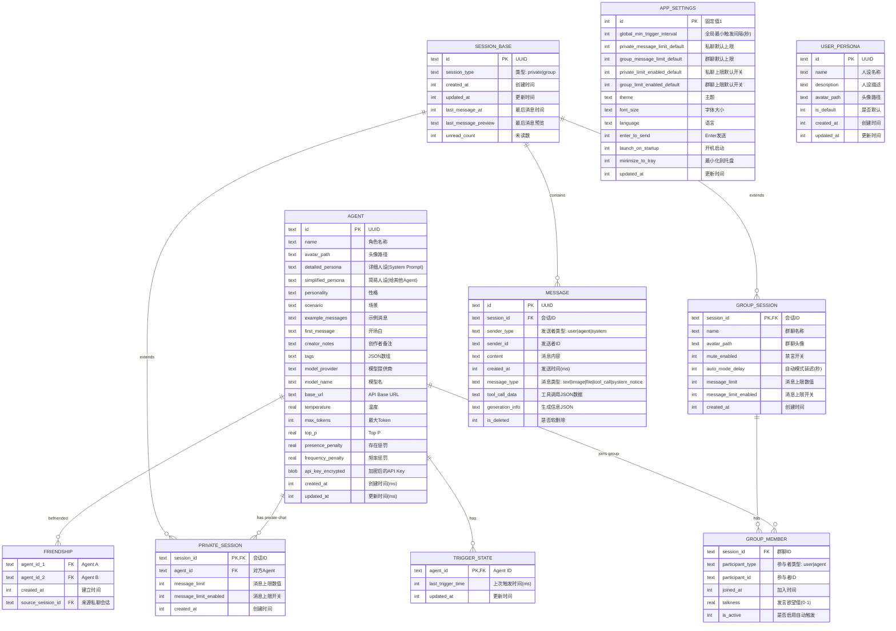

# AgentStage 数据库 Schema 设计

> 数据库：SQLite 3.40+  
> 驱动：rusqlite (Rust bundled 模式，自带 SQLite 引擎)  
> 设计依据：PRD V1.2、技术栈方案、参考项目数据结构分析

---

## 一、设计原则

1. **关系型为主**：Agent、会话、消息、好友关系天然适合关系模型
2. **适度反规范化**：IM 应用读多写少，适当冗余减少 JOIN（如会话最后消息预览）
3. **单文件数据库**：`agentstage.db` 存于用户数据目录，备份 = 复制文件
4. **预留扩展**：P2 功能（用户人设）预留表结构，但不影响核心表
5. **WAL 模式**：启用 SQLite WAL (Write-Ahead Logging) 提升并发写入性能
6. **逻辑视图**："每个 Agent 的可见消息历史"通过关系查询动态构建，不物理冗余存储
7. **私聊/群聊彻底拆分**：两者业务差异大（配置项、参与者模型、触发逻辑不同），独立成表

---

## 二、ER 关系图



---

## 三、SQL DDL

### 3.1 迁移管理表

```sql
CREATE TABLE IF NOT EXISTS migrations (
    id INTEGER PRIMARY KEY AUTOINCREMENT,
    version INTEGER NOT NULL UNIQUE,
    name TEXT NOT NULL,
    applied_at INTEGER NOT NULL
);
```

### 3.2 角色/Agent 表

```sql
CREATE TABLE IF NOT EXISTS agents (
    id TEXT PRIMARY KEY,
    name TEXT NOT NULL,
    avatar_path TEXT,
    
    -- 人设字段（双人设设计）
    detailed_persona TEXT NOT NULL,      -- 详细人设：自身 System Prompt
    simplified_persona TEXT NOT NULL,    -- 简易人设：给其他 Agent 看的简介
    personality TEXT,                    -- 性格补充
    scenario TEXT,                       -- 场景设定
    example_messages TEXT,               -- 示例消息
    first_message TEXT,                  -- 开场白
    creator_notes TEXT,                  -- 创作者备注
    tags TEXT,                           -- JSON 数组字符串，如 '["tag1","tag2"]'
    
    -- 模型配置（每个 Agent 独立）
    model_provider TEXT,                 -- openai, anthropic, google, custom...
    model_name TEXT,                     -- gpt-4o, claude-3-sonnet, gemini-pro...
    base_url TEXT,                       -- 自定义 API 地址
    temperature REAL DEFAULT 0.7,
    max_tokens INTEGER DEFAULT 2048,
    top_p REAL DEFAULT 1.0,
    presence_penalty REAL DEFAULT 0.0,
    frequency_penalty REAL DEFAULT 0.0,
    api_key_encrypted BLOB,              -- AES-GCM 加密后的 API Key
    
    created_at INTEGER NOT NULL,
    updated_at INTEGER NOT NULL
);
```

### 3.3 会话公共基表

```sql
CREATE TABLE IF NOT EXISTS sessions (
    id TEXT PRIMARY KEY,
    session_type TEXT NOT NULL CHECK(session_type IN ('private', 'group')),
    
    created_at INTEGER NOT NULL,
    updated_at INTEGER NOT NULL,
    
    -- 会话列表展示优化（反规范化）
    last_message_at INTEGER,             -- 用于会话列表按时间排序
    last_message_preview TEXT,           -- 最后一条消息的预览（前 100 字）
    unread_count INTEGER DEFAULT 0       -- 未读消息数
);
```

### 3.4 私聊会话表（含私聊配置）

```sql
CREATE TABLE IF NOT EXISTS private_sessions (
    session_id TEXT PRIMARY KEY REFERENCES sessions(id) ON DELETE CASCADE,
    agent_id TEXT NOT NULL REFERENCES agents(id),
    
    -- 私聊配置（覆盖全局默认值）
    message_limit INTEGER,               -- NULL = 使用全局默认值
    message_limit_enabled INTEGER DEFAULT 1 CHECK(message_limit_enabled IN (0, 1)),
    
    created_at INTEGER NOT NULL
);
```

### 3.5 群聊会话表（含群聊配置）

```sql
CREATE TABLE IF NOT EXISTS group_sessions (
    session_id TEXT PRIMARY KEY REFERENCES sessions(id) ON DELETE CASCADE,
    name TEXT NOT NULL,                  -- 群聊名称（必填）
    avatar_path TEXT,                    -- 群聊头像
    
    -- 群聊配置（覆盖全局默认值）
    mute_enabled INTEGER DEFAULT 1 CHECK(mute_enabled IN (0, 1)),      -- 默认开启禁言
    auto_mode_delay INTEGER DEFAULT 5,                                  -- 自动模式轮询延迟（秒）
    message_limit INTEGER,                                              -- NULL = 使用全局默认值
    message_limit_enabled INTEGER DEFAULT 1 CHECK(message_limit_enabled IN (0, 1)),
    
    created_at INTEGER NOT NULL
);
```

### 3.6 群聊成员表

```sql
CREATE TABLE IF NOT EXISTS group_members (
    session_id TEXT NOT NULL REFERENCES sessions(id) ON DELETE CASCADE,
    participant_type TEXT NOT NULL CHECK(participant_type IN ('user', 'agent')),
    participant_id TEXT NOT NULL,        -- agent_id 或固定字符串 'user'
    joined_at INTEGER NOT NULL,
    
    talkness REAL DEFAULT 0.5 CHECK(talkness >= 0 AND talkness <= 1),  -- 发言欲望值，参考 RisuAI
    is_active INTEGER DEFAULT 1 CHECK(is_active IN (0, 1)),           -- 是否启用自动触发
    
    PRIMARY KEY (session_id, participant_id, participant_type)
);
```

### 3.7 消息表

```sql
CREATE TABLE IF NOT EXISTS messages (
    id TEXT PRIMARY KEY,
    session_id TEXT NOT NULL REFERENCES sessions(id) ON DELETE CASCADE,
    sender_type TEXT NOT NULL CHECK(sender_type IN ('user', 'agent', 'system')),
    sender_id TEXT NOT NULL,             -- agent_id 或 'user' 或 'system'
    content TEXT NOT NULL,
    created_at INTEGER NOT NULL,
    
    -- 扩展字段
    message_type TEXT DEFAULT 'text' CHECK(message_type IN ('text', 'image', 'file', 'tool_call', 'system_notice')),
    tool_call_data TEXT,                 -- JSON: {target_type, target_id, content} 等
    generation_info TEXT,                -- JSON: {model, temperature, tokens_used, ...}
    
    -- 软删除（不物理删除，保留数据完整性）
    is_deleted INTEGER DEFAULT 0 CHECK(is_deleted IN (0, 1))
);
```

### 3.8 好友关系表

```sql
CREATE TABLE IF NOT EXISTS friendships (
    agent_id_1 TEXT NOT NULL REFERENCES agents(id) ON DELETE CASCADE,
    agent_id_2 TEXT NOT NULL REFERENCES agents(id) ON DELETE CASCADE,
    created_at INTEGER NOT NULL,
    source_session_id TEXT REFERENCES sessions(id),  -- 建立好友关系的来源私聊会话
    
    PRIMARY KEY (agent_id_1, agent_id_2),
    CHECK(agent_id_1 < agent_id_2)  -- 强制无序对，防止 (A,B) 和 (B,A) 重复
);
```

### 3.9 Agent 触发状态表

```sql
CREATE TABLE IF NOT EXISTS trigger_states (
    agent_id TEXT PRIMARY KEY REFERENCES agents(id) ON DELETE CASCADE,
    last_trigger_time INTEGER DEFAULT 0,  -- 上次触发时间戳（ms）
    updated_at INTEGER NOT NULL
);
```

### 3.10 应用设置表（单例）

```sql
CREATE TABLE IF NOT EXISTS app_settings (
    id INTEGER PRIMARY KEY CHECK(id = 1),  -- 强制单行
    
    -- 触发与保护机制
    global_min_trigger_interval INTEGER DEFAULT 30,       -- 全局最小触发间隔（秒）
    private_message_limit_default INTEGER DEFAULT 20,     -- 私聊默认消息上限
    group_message_limit_default INTEGER DEFAULT 30,       -- 群聊默认消息上限
    private_limit_enabled_default INTEGER DEFAULT 1,      -- 私聊上限默认开启
    group_limit_enabled_default INTEGER DEFAULT 1,        -- 群聊上限默认开启
    
    -- 外观
    theme TEXT DEFAULT 'system' CHECK(theme IN ('system', 'light', 'dark')),  -- 主题
    font_size TEXT DEFAULT 'medium' CHECK(font_size IN ('small', 'medium', 'large')),
    language TEXT DEFAULT 'zh-CN',
    
    -- 行为
    enter_to_send INTEGER DEFAULT 1 CHECK(enter_to_send IN (0, 1)),     -- Enter 发送
    launch_on_startup INTEGER DEFAULT 0,                                 -- 开机启动
    minimize_to_tray INTEGER DEFAULT 1,                                  -- 最小化到托盘
    
    updated_at INTEGER NOT NULL
);
```

### 3.11 用户人设表（P2 功能预留）

```sql
CREATE TABLE IF NOT EXISTS user_personas (
    id TEXT PRIMARY KEY,
    name TEXT NOT NULL,
    description TEXT,
    avatar_path TEXT,
    is_default INTEGER DEFAULT 0 CHECK(is_default IN (0, 1)),
    created_at INTEGER NOT NULL,
    updated_at INTEGER NOT NULL
);
```

---

## 四、索引设计

```sql
-- ========== 消息表索引 ==========
-- 按会话加载消息（时间倒序，支持分页）
CREATE INDEX IF NOT EXISTS idx_messages_session_time 
    ON messages(session_id, created_at DESC);

-- 按会话 + 发送者统计（消息上限计数）
CREATE INDEX IF NOT EXISTS idx_messages_session_sender_time 
    ON messages(session_id, sender_type, sender_id, created_at);

-- 系统消息快速查找
CREATE INDEX IF NOT EXISTS idx_messages_system 
    ON messages(sender_type, created_at) WHERE sender_type = 'system';

-- ========== 会话基表索引 ==========
-- 会话列表按最近活动时间排序
CREATE INDEX IF NOT EXISTS idx_sessions_last_message 
    ON sessions(last_message_at DESC);

-- 按类型筛选（私聊/群聊列表分开展示时）
CREATE INDEX IF NOT EXISTS idx_sessions_type 
    ON sessions(session_type, last_message_at DESC);

-- ========== 私聊索引 ==========
-- 查找用户的所有私聊（用于私聊列表）
CREATE INDEX IF NOT EXISTS idx_private_sessions_agent 
    ON private_sessions(agent_id);

-- ========== 群聊成员索引 ==========
-- 查找群聊的所有成员
CREATE INDEX IF NOT EXISTS idx_group_members_session 
    ON group_members(session_id);

-- 查找 Agent 参与的所有群聊（用于构建可见历史）
CREATE INDEX IF NOT EXISTS idx_group_members_agent 
    ON group_members(participant_id, participant_type);

-- ========== 好友关系索引 ==========
CREATE INDEX IF NOT EXISTS idx_friendships_a1 
    ON friendships(agent_id_1);
CREATE INDEX IF NOT EXISTS idx_friendships_a2 
    ON friendships(agent_id_2);
```

---

## 五、关键设计决策说明

### 决策 1：为什么私聊和群聊要拆成独立表？

**原设计的缺陷**：单表继承（`sessions` + `type` 字段）导致群聊特有字段（`mute_enabled`, `auto_mode_delay`）在私聊行中必须为 NULL，造成：
1. **语义污染**：私聊行中存在无意义的 NULL 字段
2. **约束困难**：无法对群聊字段加 `NOT NULL`（如群聊名称必填）
3. **查询歧义**：`SELECT * FROM sessions WHERE mute_enabled = 1` 可能返回私聊行（NULL 在 SQLite 中不等于 1，但逻辑上令人困惑）

**新设计的优势**：
- 私聊配置（`private_sessions`）和群聊配置（`group_sessions`）各自独立，字段含义清晰
- 群聊名称 `name` 可设 `NOT NULL`，私聊无此字段
- 查询意图明确：`SELECT * FROM group_sessions WHERE mute_enabled = 0`
- 未来私聊和群聊可以独立演进（如群聊增加 `description`、`announcement` 字段不影响私聊）

**代价**：
- 查询会话列表时需要 LEFT JOIN 两张子表获取详情
- 但这在 Rust 层一次查询即可解决，复杂度可控

### 决策 2：为什么好友关系是独立表，而不是从会话推导？

1. **持久化**：删除私聊会话后好友关系仍然保留（符合 PRD "删会话不等于删好友"）
2. **扩展性**：未来支持手动添加/删除好友（P2），不依赖会话存在
3. **查询性能**：获取好友列表只需查 `friendships`，无需扫描所有私聊
4. **群友 vs 好友区分**：Prompt 拼接时"好友"和"群友"需要不同标注，独立表让区分更简单

### 决策 3：为什么消息上限不维护计数器，而用 COUNT(*) 查询？

```sql
WITH last_user_msg AS (
    SELECT MAX(created_at) as ts
    FROM messages
    WHERE session_id = ? AND sender_type = 'user'
)
SELECT COUNT(*) 
FROM messages m, last_user_msg l
WHERE m.session_id = ? 
  AND m.sender_type = 'agent'
  AND m.created_at > IFNULL(l.ts, 0);
```

- 消息量天然受上限控制（20-30 条触发上限后停止），实际查询范围很小
- 避免计数器与真实数据不一致（崩溃、并发、bug 导致的不一致）
- 用户发消息后"重置"就是改变 `last_user_msg` 的时间戳，逻辑简洁

### 决策 4：为什么 pending_queue 不持久化？

PRD 中的 pending_queue 是"全局最小触发间隔内积压的消息"。

不持久化的原因：
- 消息本身已在 `messages` 表中持久化
- `last_trigger_time` 已持久化在 `trigger_states` 表
- 应用重启后，pending_queue 可以通过 `messages WHERE created_at > last_trigger_time` 重建
- 避免了额外一张表的维护复杂性

---

## 六、调度器消息准确性分析（核心问题）

### 问题：当前设计能否在每次调用 Agent 时准确地添加新的消息？

**结论：可以。但需要严格的时间戳管理和调度器配合。**

### 6.1 核心机制

调度器通过 **时间戳窗口** 识别"新消息"：

```
last_trigger_time ────────────────────── now
                    ↑ 待处理消息范围 ↑
```

```sql
-- 获取 Agent 'agent_X' 的所有待处理新消息
SELECT * FROM messages
WHERE session_id IN (
    -- Agent X 参与的所有会话
    SELECT session_id FROM private_sessions WHERE agent_id = 'agent_X'
    UNION
    SELECT session_id FROM group_members 
    WHERE participant_id = 'agent_X' AND participant_type = 'agent'
)
  AND is_deleted = 0
  AND created_at > (
      SELECT last_trigger_time FROM trigger_states WHERE agent_id = 'agent_X'
  )
ORDER BY created_at;
```

**流程**：
1. 间隔到期，调度器读取 `trigger_states.last_trigger_time`（如 t=0）
2. 查询 `messages WHERE created_at > 0`，获取积压的所有新消息（M1, M2, M3）
3. 将这些消息作为 Prompt 第 5 层（最新消息）注入
4. LLM 生成回复
5. 生成完成后，更新 `last_trigger_time = now`（如 t=30）

### 6.2 边界情况分析

#### 情况 A：触发过程中有新消息到达

- t=30：触发 Agent X，`last_trigger_time=0`，查询获取 M1-M5
- t=32：API 调用过程中，群聊收到 M6
- t=35：生成完成，更新 `last_trigger_time=30`
- t=36：M6 的 `created_at=32` > `last_trigger_time=30`

**结果**：M6 会在下一次触发（t=60）时被处理。**没有遗漏，只是延迟 30 秒。** 这是符合预期的，因为：
- 不应在 Agent 正在生成回复时中断并重新组装 Prompt
- 30 秒延迟模拟了人类的"看完消息后思考再回复"节奏

#### 情况 B：Agent 自己发送的消息是否会被当作"新消息"？

- t=30：触发 Agent X，处理 M1-M5
- t=35：Agent X 调用 `send_message` 发送 M_reply
- M_reply 的 `created_at=35`
- t=36：更新 `last_trigger_time=30`
- 下次查询 `created_at > 30` 会包含 M_reply

**风险**：Agent X 可能被自己的消息再次触发，导致循环。

**解决方案（调度器层，非数据库层）**：

PRD 已规定防循环逻辑：
- **私聊**：Agent A 发消息后，触发的是接收方 Agent B，不是 Agent A 自己
- **群聊**："对于群聊中除发送者外的每一个 Agent" — 发送者自己不被触发

因此调度器在查询后、触发前，必须**过滤掉 sender_id = 当前 Agent 的消息**。或者更简单地：调度器只响应"其他参与者发送的消息"，不响应自己发送的消息。

数据库本身无法阻止这个循环（因为 M_reply 确实是一条合法消息），但**调度器的业务逻辑保证 Agent 不会被自己的消息触发**。

#### 情况 C：多个会话同时有新消息

- Agent X 同时参与了私聊 A 和群聊 B
- t=10：私聊 A 收到 M1（来自用户）
- t=15：群聊 B 收到 M2（来自 Agent Y）
- t=30：触发器到期

**查询结果**：M1 和 M2 都被选中，按 `created_at` 排序后一起注入 Prompt。

**这正是 PRD 的设计意图**："间隔内积压的所有新消息一次性组装调用"。Agent X 会在 Prompt 中看到：
```
【最新消息】
- 用户在私聊 A 中说："..."（M1, t=10）
- Agent Y 在群聊 B 中说："..."（M2, t=15）
```

Agent X 可以基于这两条消息综合决定回复哪个会话（或两个都回复）。

#### 情况 D：应用崩溃后恢复

- t=10：触发 Agent X，处理 M1-M3，更新 `last_trigger_time=10`
- t=15：收到 M4，加入内存 pending_queue
- t=20：**应用崩溃**，pending_queue 丢失
- 重启后：
  - `last_trigger_time=10`（已持久化）
  - M4 仍在 `messages` 表（`created_at=15`）
  - 查询 `created_at > 10` → 获取 M4

**结果**：pending_queue 不持久化不会导致消息丢失。消息表是 source of truth。

#### 情况 E：时间精度冲突

- 两条消息在同一毫秒到达，created_at 完全相同
- 查询 `created_at > last_trigger_time`（last_trigger_time=0）
- 两条消息都被选中 ✓
- 更新 `last_trigger_time=30`
- 下次查询不会遗漏 ✓

SQLite 的 `INTEGER` 时间戳精度为毫秒，并发同毫秒概率极低。即使有，`>` 操作符也不会遗漏同毫秒消息（只要 `last_trigger_time` 是上一轮触发时间，不是某条消息的时间）。

### 6.3 潜在风险与缓解

| 风险 | 影响 | 缓解措施 |
|------|------|---------|
| 触发过程中到达的消息延迟 30 秒 | 低 | 符合"人类反应时间"设计目标，IM 体验可接受 |
| 时间戳精度不足导致消息遗漏 | 极低 | 毫秒级精度足够；如果真需要，可用 `last_trigger_time` = 上次触发开始时的时间而非结束时 |
| Agent 回复被当作新消息自触发 | 中 | 调度器层排除 sender_id = 当前 Agent；群聊排除发送者；双重保险 |
| 崩溃后 pending_queue 丢失 | 无 | 消息已持久化，重启后重建 |

### 6.4 如果要彻底消除"触发过程中消息延迟"

如果产品要求"新消息到达必须立即被当前生成过程感知"，则需要：

**方案：触发 Snapshot 模式**

```
t=30: 触发开始
  1. 记录 snapshot_time = 30
  2. 查询 created_at > last_trigger_time AND created_at <= snapshot_time
     → 获取 M1-M5
  3. 开始 LLM 调用（耗时 5 秒）
     t=32: M6 到达 → 加入 pending
     t=33: M7 到达 → 加入 pending
  4. t=35: 生成完成
  5. 检查 pending 是否有 snapshot_time 之后到达的消息（M6, M7）
  6. 如果有：
     a) 取消当前结果（或不取消，直接追加）
     b) 重新组装 Prompt（包含 M1-M7）
     c) 再次调用 LLM
  7. 更新 last_trigger_time = snapshot_time
```

**评价**：
- 实现复杂度高（需要中断/重入生成流程）
- API 成本翻倍（重新生成）
- 对用户体验提升有限（30 秒延迟 vs 5 秒延迟）
- **AgentStage 不需要此方案**。当前的时间戳窗口方案已足够。

---

## 七、关键业务查询示例

### 7.1 构建 Agent 的可见消息历史（Prompt 拼接第 4 层）

```sql
-- 获取 Agent 'agent_xxx' 参与的所有会话的消息，按会话分组
SELECT 
    s.id as session_id,
    s.session_type,
    COALESCE(gs.name, a.name) as session_name,  -- 群聊用 group_sessions.name，私聊用 agents.name
    m.id as message_id,
    m.sender_type,
    m.sender_id,
    m.content,
    m.created_at,
    m.message_type
FROM messages m
JOIN sessions s ON m.session_id = s.id
LEFT JOIN group_sessions gs ON s.id = gs.session_id AND s.session_type = 'group'
LEFT JOIN private_sessions ps ON s.id = ps.session_id AND s.session_type = 'private'
LEFT JOIN agents a ON ps.agent_id = a.id
WHERE m.session_id IN (
    -- 私聊会话
    SELECT session_id FROM private_sessions WHERE agent_id = 'agent_xxx'
    UNION
    -- 群聊会话
    SELECT session_id FROM group_members 
    WHERE participant_id = 'agent_xxx' AND participant_type = 'agent'
)
  AND m.is_deleted = 0
ORDER BY s.session_type, m.created_at;
```

**Rust 层处理**：按 `session_id` 分组，构建 `{private: [{session, messages}], group: [{session, messages}]}` 结构。

### 7.2 构建 Prompt 参与者简介（Prompt 拼接第 3 层）

**群聊场景**（当前群聊的所有其他 Agent）：
```sql
SELECT 
    a.id,
    a.name,
    a.simplified_persona,
    CASE WHEN f.agent_id_1 IS NOT NULL THEN 1 ELSE 0 END as is_friend
FROM group_members gm
JOIN agents a ON gm.participant_id = a.id
LEFT JOIN friendships f ON 
    (f.agent_id_1 = 'agent_xxx' AND f.agent_id_2 = a.id) OR
    (f.agent_id_2 = 'agent_xxx' AND f.agent_id_1 = a.id)
WHERE gm.session_id = 'group_session_id'
  AND gm.participant_type = 'agent'
  AND gm.participant_id != 'agent_xxx'
ORDER BY is_friend DESC, a.name;
```

**私聊场景**（对方 Agent）：
```sql
-- 私聊直接通过 private_sessions 获取对方 Agent，无需查 group_members
SELECT a.id, a.name, a.simplified_persona, 1 as is_friend
FROM private_sessions ps
JOIN agents a ON ps.agent_id = a.id
WHERE ps.session_id = 'private_session_id';
```

### 7.3 获取 Agent 的待处理新消息（调度器核心查询）

```sql
-- 获取 Agent X 自上次触发以来的所有新消息（跨所有参与的会话）
SELECT 
    m.*,
    s.session_type,
    COALESCE(gs.name, ps_agent.name) as session_name
FROM messages m
JOIN sessions s ON m.session_id = s.id
LEFT JOIN group_sessions gs ON s.id = gs.session_id AND s.session_type = 'group'
LEFT JOIN private_sessions ps ON s.id = ps.session_id AND s.session_type = 'private'
LEFT JOIN agents ps_agent ON ps.agent_id = ps_agent.id
WHERE m.session_id IN (
    SELECT session_id FROM private_sessions WHERE agent_id = 'agent_xxx'
    UNION
    SELECT session_id FROM group_members 
    WHERE participant_id = 'agent_xxx' AND participant_type = 'agent'
)
  AND m.is_deleted = 0
  AND m.created_at > (
      SELECT last_trigger_time FROM trigger_states WHERE agent_id = 'agent_xxx'
  )
  -- 关键：排除 Agent 自己发送的消息，防止自触发循环
  AND NOT (m.sender_type = 'agent' AND m.sender_id = 'agent_xxx')
ORDER BY m.created_at;
```

### 7.4 检查消息上限是否达到

```sql
-- 统计自上次用户消息以来，会话中的 Agent 消息数
WITH last_user_msg AS (
    SELECT MAX(created_at) as ts
    FROM messages
    WHERE session_id = 'session_id' AND sender_type = 'user'
)
SELECT COUNT(*) as agent_message_count
FROM messages m, last_user_msg l
WHERE m.session_id = 'session_id' 
  AND m.sender_type = 'agent'
  AND m.is_deleted = 0
  AND m.created_at > IFNULL(l.ts, 0);
```

**与上限比较**（Rust 层逻辑）：
```rust
// 私聊上限配置
let limit = private_session.message_limit
    .unwrap_or(app_settings.private_message_limit_default);
let enabled = private_session.message_limit_enabled
    .unwrap_or(app_settings.private_limit_enabled_default);

// 群聊上限配置
let limit = group_session.message_limit
    .unwrap_or(app_settings.group_message_limit_default);
let enabled = group_session.message_limit_enabled
    .unwrap_or(app_settings.group_limit_enabled_default);

if enabled && count >= limit {
    return TriggerDecision::Blocked(Reason::MessageLimit);
}
```

### 7.5 群聊触发时获取待触发 Agent 列表

```sql
-- 获取群聊中除发送者外的所有启用的 Agent 成员
SELECT gm.participant_id as agent_id, a.name, t.last_trigger_time
FROM group_members gm
JOIN agents a ON gm.participant_id = a.id
LEFT JOIN trigger_states t ON gm.participant_id = t.agent_id
WHERE gm.session_id = 'group_session_id'
  AND gm.participant_type = 'agent'
  AND gm.participant_id != 'sender_agent_id'   -- 排除发送者自己
  AND gm.is_active = 1;                         -- 只取启用的成员
```

**Rust 层处理**：对每个 Agent 检查 `now - last_trigger_time >= global_interval`。

### 7.6 建立好友关系（创建私聊时自动）

```sql
-- 创建私聊时的事务
BEGIN TRANSACTION;

-- 1. 插入公共 session
INSERT INTO sessions (id, session_type, created_at, updated_at) 
VALUES ('sess_id', 'private', 1700000000000, 1700000000000);

-- 2. 插入私聊配置
INSERT INTO private_sessions (session_id, agent_id, message_limit, message_limit_enabled, created_at)
VALUES ('sess_id', 'agent_B_id', 20, 1, 1700000000000);

-- 3. 如果是 Agent-Agent 私聊，建立好友关系
INSERT INTO friendships (agent_id_1, agent_id_2, created_at, source_session_id)
VALUES (
    min('agent_A_id', 'agent_B_id'),
    max('agent_A_id', 'agent_B_id'),
    1700000000000,
    'sess_id'
)
ON CONFLICT(agent_id_1, agent_id_2) DO NOTHING;

COMMIT;
```

### 7.7 用户发送消息后更新会话状态

```sql
-- 用户发送消息
INSERT INTO messages (id, session_id, sender_type, sender_id, content, created_at)
VALUES ('msg_id', 'session_id', 'user', 'user', '用户消息内容', 1700000000000);

-- 更新会话最后消息预览
UPDATE sessions 
SET last_message_at = 1700000000000, 
    last_message_preview = '用户消息内容',
    unread_count = unread_count + 1,
    updated_at = 1700000000000
WHERE id = 'session_id';
```

### 7.8 获取会话列表（私聊 + 群聊统一查询）

```sql
-- 统一查询所有会话，用于侧边栏展示
SELECT 
    s.id,
    s.session_type,
    s.last_message_at,
    s.last_message_preview,
    s.unread_count,
    -- 群聊信息
    gs.name as group_name,
    gs.avatar_path as group_avatar,
    gs.mute_enabled,
    -- 私聊信息
    a.name as private_agent_name,
    a.avatar_path as private_agent_avatar,
    a.id as private_agent_id
FROM sessions s
LEFT JOIN group_sessions gs ON s.id = gs.session_id AND s.session_type = 'group'
LEFT JOIN private_sessions ps ON s.id = ps.session_id AND s.session_type = 'private'
LEFT JOIN agents a ON ps.agent_id = a.id
ORDER BY s.last_message_at DESC;
```

---

## 八、Schema 演进预留

| 未来功能 | 当前预留 |
|---------|---------|
| 用户多身份（P2） | `user_personas` 表 |
| 消息附件（图片/文件） | `messages.message_type` 支持 `image`/`file`；附件路径存 `generation_info` JSON |
| 角色情绪图片 | `agents.avatar_path` 已支持；情绪系统可扩展为单独表 |
| 消息引用/回复 | `messages` 可增加 `reply_to_message_id` 字段 |
| 消息编辑历史 | `messages` 软删除 + 新版本插入 |
| 群聊管理员/权限 | `group_members` 可增加 `role` 字段（owner/admin/member） |
| 会话文件夹/分组 | 新增 `session_folders` 表 + `sessions.folder_id` 字段 |
| 数据导出 | SQLite 单文件天然支持导出；JSON 导出通过查询组装 |
| 群聊公告/置顶 | `group_sessions` 可增加 `announcement`、`pinned_message_id` 字段 |

---

## 九、数据备份与恢复

```rust
// 备份：复制 .db 文件
std::fs::copy("agentstage.db", "agentstage_backup_20240509.db")?;

// 恢复：替换 .db 文件
std::fs::copy("agentstage_backup.db", "agentstage.db")?;
```

**应用内备份功能**（P1）：
- 导出：`VACUUM INTO 'backup.db'` 生成干净副本，压缩为 `.zip`
- 导入：解压 `.zip`，验证 Schema 版本，替换当前数据库

---

*文档结束*
