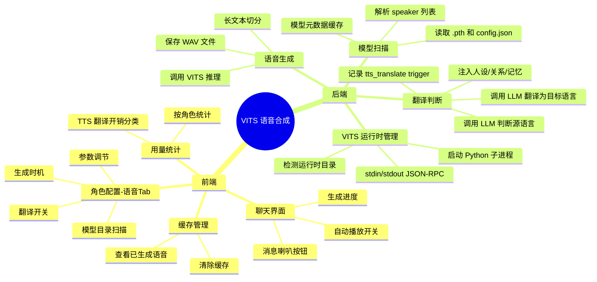
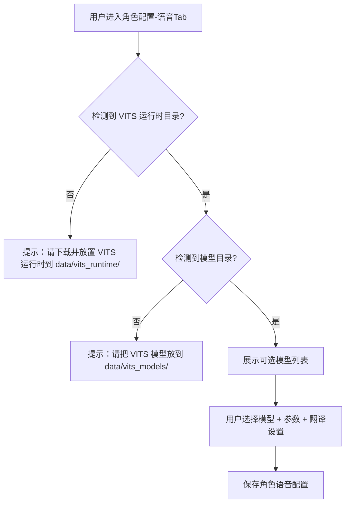
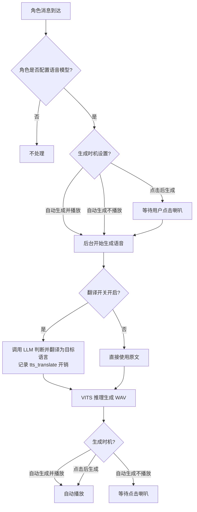

# VITS 语音合成（TTS）接入设计

> **关联计划文件：** 后续实施时将引用本文档作为设计依据。  
> **Feature List 更新：** `docs/feature_list.md` 模块 4.5「VITS 语音与 TTS」

---

## 1. 文档信息

| 字段 | 内容 |
|-----|------|
| 产品名称 | AgentStage |
| 文档版本 | V1.1 |
| 编写日期 | 2026-08-06 |
| 编写人 | Codex Assistant |
| 关联需求 | 角色配置页语音模型、聊天消息语音朗读、自动翻译、翻译开销统计 |
| 技术路线 | Python VITS 推理运行时 + Rust 后端常驻子进程（stdin/stdout JSON-RPC） |

---

## 2. 项目背景

### 2.1 业务目标
让 AgentStage 的角色具备离线 VITS 语音合成能力。用户把 VITS `.pth` 模型放到本地目录后，即可在角色配置中绑定模型，并在聊天中为角色消息生成/播放语音。

### 2.2 目标用户
- **角色扮演爱好者**：希望角色回复带有"声音"，增强沉浸感。
- **小说/剧本创作者**：需要让多个角色用不同音色"朗读"对白。
- **AI 探索者**：希望体验本地 VITS 模型在聊天场景中的效果。

### 2.3 核心卖点
> 让 AgentStage 的每个角色都能拥有本地 VITS 语音，支持跨语言自动翻译朗读，且无需联网即可使用。

---

## 3. 产品架构

### 3.1 功能架构图



### 3.2 角色定义

| 角色名称 | 角色描述 | 主要权限 |
|---------|---------|---------|
| 普通用户 | 使用语音功能、配置角色语音 | 配置模型、生成/播放/删除语音 |
| 系统 | 管理运行时进程、扫描模型、缓存清理 | 后台管理、无用户可见界面 |

---

## 4. 核心业务流程

### 4.1 首次使用 VITS 语音



### 4.2 聊天中生成语音



---

## 5. 详细功能说明

### 5.1 角色配置页语音 Tab

| 字段 | 说明 |
|-----|------|
| **功能编号** | VOICE-02（改造） |
| **功能描述** | 在角色编辑页面新增「语音」Tab，用于配置该角色的 VITS 语音模型和参数 |
| **前置条件** | 角色已创建；应用已检测到 `data/vits_runtime/` 和 `data/vits_models/` |
| **优先级** | P0 |

**页面元素：**

| 元素 | 类型 | 说明 | 校验规则 |
|-----|------|------|---------|
| 运行时状态提示 | 文本 | 显示 VITS 运行时是否已放置 | 未放置时显示红色警告 |
| 模型目录提示 | 文本 | 提示用户把模型文件夹放到 `data/vits_models/` | 不可编辑 |
| 刷新模型按钮 | 按钮 | 重新扫描 `data/vits_models/` 下的模型 | 手动触发 |
| 模型选择下拉框 | 下拉 | 列出扫描到的模型名称 | 至少一个模型时才可选 |
| 目标语言选择 | 下拉 | 语音输出语言（如中文、日语、英语） | 默认"跟随模型" |
| 情感参数 | 滑动条/输入 | VITS 情感参数（如 `emotion` 或 `sid`） | 范围由模型 config 决定 |
| 语速调节 | 滑动条 | 语音速度（如 `length_scale`） | 0.5 ~ 2.0，默认 1.0 |
| 音调/其他参数 | 滑动条 | 可选的音调参数（如 `f0`） | 模型支持时才显示 |
| 翻译开关 | 开关 | 当文本语言与目标语言不一致时自动翻译 | 默认开启 |
| 翻译模型选择 | 下拉 | 选择翻译用 LLM，默认"该角色已配置模型" | 使用现有 model config |
| 生成时机 | 单选 | ①自动生成并播放 ②自动生成不播放 ③点击后生成并播放 | 默认② |
| 保存按钮 | 按钮 | 保存配置 | 运行时未放置时禁用 |

**交互逻辑：**
1. 用户进入角色编辑页，切换到「语音」Tab。
2. 系统检测 `data/vits_runtime/` 和 `data/vits_models/` 是否存在。
3. 若运行时未放置，显示提示和目录路径，禁用所有配置项。
4. 若模型目录为空，提示用户放置模型。
5. 用户点击「刷新模型」，系统扫描目录并更新模型列表。
6. 用户选择模型、参数、翻译设置、生成时机。
7. 点击保存，配置写入数据库。

**异常处理：**

| 异常场景 | 处理方式 |
|---------|---------|
| 运行时未放置 | 顶部红色提示，禁用保存和模型选择 |
| 模型目录为空 | 显示"暂无模型"占位，提示放置路径 |
| 选择的模型缺少 config.json | 标记为"不可用"，不可选择 |
| 模型 config 中无目标语言 speaker | 提示"该模型可能不支持此目标语言" |

---

### 5.2 模型目录与运行时检测

| 字段 | 说明 |
|-----|------|
| **功能编号** | VOICE-01（改造） |
| **功能描述** | 检测 VITS Python 运行时和模型目录，扫描可用模型 |
| **优先级** | P0 |

**目录约定：**

```
data/
├── vits_runtime/          # PyInstaller 打包的 Python 运行时
│   ├── vits_runtime.exe
│   └── ...
└── vits_models/           # 用户放置的模型目录
    ├── model_a/
    │   ├── config.json
    │   └── model_a.pth
    ├── model_b/
    │   ├── config.json
    │   └── model_b.pth
    └── ...
```

**模型识别规则：**
- 一个模型目录必须包含 `config.json` 和 `.pth` 文件。
- 目录名作为模型展示名。
- `config.json` 中解析：
  - `model.language` 或 `data.language` 作为模型语言
  - `speakers` 或 `spk` 作为可选 speaker 列表
  - 文本前端、cleaners、情感参数字段

**后端命令：**
- `scan_vits_models`：扫描 `data/vits_models/`，返回模型列表
- `check_vits_runtime`：检测 `data/vits_runtime/` 是否存在且可执行

---

### 5.3 聊天消息语音按钮

| 字段 | 说明 |
|-----|------|
| **功能编号** | VOICE-03（改造） |
| **功能描述** | 在配置了语音模型的角色消息旁显示喇叭按钮，点击播放对应语音 |
| **优先级** | P0 |

**页面元素：**

| 元素 | 类型 | 说明 |
|-----|------|------|
| 喇叭按钮 | 图标按钮 | 每条角色消息右侧，hover 时显示 |
| 生成进度指示 | 进度条/旋转图标 | 语音生成中显示 |
| 播放指示 | 波形/高亮 | 播放中显示 |
| 停止按钮 | 图标按钮 | 播放中点击停止 |

**交互逻辑：**
1. 消息渲染时，若该角色配置了语音模型，则显示喇叭按钮。
2. 若该消息已有缓存语音，点击直接播放。
3. 若语音正在生成，按钮显示进度。
4. 若生成时机为"点击后生成"，点击按钮开始生成，生成完成后自动播放。
5. 播放时显示停止按钮，点击可停止。

**异常处理：**

| 异常场景 | 处理方式 |
|---------|---------|
| 语音生成失败 | 显示错误提示，按钮恢复可点击 |
| 缓存文件丢失 | 重新生成 |
| 运行时突然缺失 | 提示用户放置运行时 |

---

### 5.4 生成时机配置

| 字段 | 说明 |
|-----|------|
| **功能编号** | VOICE-04（改造） / 新增 VOICE-06 |
| **功能描述** | 提供三种生成时机，按角色配置 |
| **优先级** | P1 |

**三种模式：**

| 模式 | 编号 | 行为 |
|-----|------|------|
| 自动生成并播放 | VOICE-06 | 角色消息到达后立即后台生成，生成后自动播放 |
| 自动生成不播放 | VOICE-07 | 角色消息到达后立即后台生成，但不播放，等待用户点击喇叭 |
| 点击后生成并播放 | VOICE-08 | 用户点击喇叭后才开始生成，生成完成后自动播放 |

**默认模式：** 自动生成不播放。

---

### 5.5 语音缓存管理

| 字段 | 说明 |
|-----|------|
| **功能编号** | VOICE-09 |
| **功能描述** | 所有生成的语音保存到本地，提供查看和清理缓存入口 |
| **优先级** | P1 |

**目录约定：**

```
data/vits_cache/
├── <session_id>/
│   └── <message_id>.wav
└── ...
```

**前端入口：**
- 在角色配置语音 Tab 增加"查看语音缓存"按钮。
- 或在全局设置中增加"语音缓存"入口。

**功能：**
- 列出缓存文件（按角色/会话分组）。
- 显示每个缓存的大小和生成时间。
- 支持单个删除和全部清空。
- 支持按会话清空。

**后端命令：**
- `list_vits_cache`
- `delete_vits_cache`
- `clear_vits_cache`

---

### 5.6 自动翻译

| 字段 | 说明 |
|-----|------|
| **功能编号** | VOICE-10 |
| **功能描述** | 当角色消息语言与目标语音语言不一致时，自动翻译为生成语言 |
| **优先级** | P0 |

**行为：**
- 开关默认开启。
- 在角色语音配置中设置目标语言。
- 生成语音前，调用 LLM 判断消息语言：
  - 若一致：直接使用原文。
  - 若不一致：调用 LLM 翻译为目标语言。
- 翻译过程独立调用，不计入正常会话。
- 提示用户：开启翻译会增加 LLM 调用开销，导致语音生成时间变长。

**翻译模型：**
- 默认使用角色已配置的 LLM 模型。
- 可下拉选择其他已配置的模型。

---

### 5.7 翻译判断工具（后端）

| 字段 | 说明 |
|-----|------|
| **功能编号** | VOICE-11 |
| **功能描述** | 后端提供独立工具，调用 LLM 完成语言判断和翻译 |
| **优先级** | P0 |

**工具接口：**

```rust
struct TranslateForTtsRequest {
    text: String,
    target_language: String,
    agent_persona: String,
    agent_relationships: String,
    memories: String,
    model_config_id: String,
}

struct TranslateForTtsResponse {
    need_translate: bool,
    translated_text: String,
}
```

**提示词要求：**
- 要求 LLM 先判断文本语言是否与目标语言一致。
- 若不一致，翻译成目标语言。
- 翻译结果必须保持角色的人设、关系和记忆语境。
- 给出示例："同一句中文用日语表达时，应符合该角色的说话风格。"

**调用方式：**
- 完全独立于正常会话调度。
- 不暴露给角色，不进入聊天记录。
- 调用失败时回退到原文。
- **用量记录**：在 `llm_usage_records` 表中记录为 `trigger_type = "tts_translate"`。

---

### 5.8 TTS 翻译开销统计

| 字段 | 说明 |
|-----|------|
| **功能编号** | VOICE-12 |
| **功能描述** | 翻译调用的 LLM 开销在用量统计中单独分类，并支持按角色查看 |
| **优先级** | P1 |

**实现方式：**
- 复用现有 `llm_usage_records` 表结构，不新增字段。
- 在翻译调用时，将 `trigger_type` 设置为 `"tts_translate"`。
- 现有 `get_usage_by_trigger` 接口自然支持按 trigger 分类统计。
- 现有 `get_usage_by_agent` 接口支持按角色统计，前端过滤 `trigger_type = "tts_translate"` 即可。
- 在用量统计页面增加"TTS 翻译"作为独立的触发类型筛选选项。

**前端展示：**
- 在模型用量统计页（`MON-01`）的 Trigger 筛选下拉框中增加"TTS 翻译"选项。
- 按角色统计表格中，TTS 翻译行的 trigger 显示为"TTS 翻译"。
- 可与其他触发类型（如 `user_message`、`timer`）区分。

---

## 6. 数据模型

### 6.1 新增表

```sql
CREATE TABLE agent_voices (
    id TEXT PRIMARY KEY,
    agent_id TEXT NOT NULL,
    model_name TEXT NOT NULL,          -- 目录名
    model_path TEXT NOT NULL,            -- data/vits_models/ 下的绝对路径
    speaker_id TEXT,                     -- 多 speaker 模型时使用
    target_language TEXT NOT NULL,       -- 目标语音语言
    emotion_params TEXT,                 -- JSON 情感参数
    speed REAL DEFAULT 1.0,                -- 语速
    translate_enabled INTEGER DEFAULT 1, -- 翻译开关
    translate_model_config_id TEXT,      -- 翻译用模型
    generation_mode TEXT NOT NULL,       -- auto_play / auto_silent / manual
    created_at TEXT NOT NULL,
    updated_at TEXT NOT NULL,
    FOREIGN KEY (agent_id) REFERENCES agents(id)
);

CREATE TABLE vits_cache (
    id TEXT PRIMARY KEY,
    message_id TEXT NOT NULL,
    session_id TEXT NOT NULL,
    agent_id TEXT NOT NULL,
    file_path TEXT NOT NULL,
    file_size INTEGER,
    created_at TEXT NOT NULL,
    FOREIGN KEY (message_id) REFERENCES messages(id)
);
```

### 6.2 复用现有表

- `llm_usage_records`：翻译调用时写入 `trigger_type = "tts_translate"`。

---

## 7. 非功能需求

### 7.1 性能

| 指标 | 要求 |
|-----|------|
| 模型扫描 | ≤ 1s（模型数量 ≤ 50） |
| 语音生成 | 首次含模型加载 ≤ 10s，后续 ≤ 5s |
| 翻译调用 | 增加 1~3s，取决于模型速度 |

### 7.2 安全

- VITS Python 运行时只从指定目录加载，禁止用户输入拼接路径。
- 不缓存 LLM 翻译结果，保护会话隐私。
- 翻译调用时只注入脱敏后的人设、关系、记忆摘要。

### 7.3 兼容性

- 仅支持 Windows 桌面端。
- 仅支持 `.pth` 格式 VITS 模型。
- 模型 config 中必须包含可识别的 speaker 和 cleaners。

---

## 8. 迭代规划

| 版本 | 包含功能 |
|-----|---------|
| MVP | VOICE-01/02/03/10/11：运行时检测、模型扫描、角色语音配置、聊天喇叭、自动翻译 |
| V1.1 | VOICE-06/07/08：三种生成时机 |
| V1.2 | VOICE-09：语音缓存管理 + 参数调节（情感、语速） |
| V1.3 | VOICE-12：TTS 翻译开销统计 + 按角色筛选 |

---

## 9. 依赖与假设

- 用户需要自行下载 PyInstaller 打包的 VITS 运行时并放入 `data/vits_runtime/`。
- 用户需要自行准备 VITS `.pth` 模型并放入 `data/vits_models/`。
- 运行时包由项目提供下载链接，不包含在主安装包中。
- 后续不切换为纯 Rust/ONNX 推理。

---

## 10. 参考

- VITS 官方：`github.com/jaywalnut310/vits`
- MoeGoe：`github.com/CjangCjengh/MoeGoe`
- GPT-SoVITS：`github.com/RVC-Boss/GPT-SoVITS`

